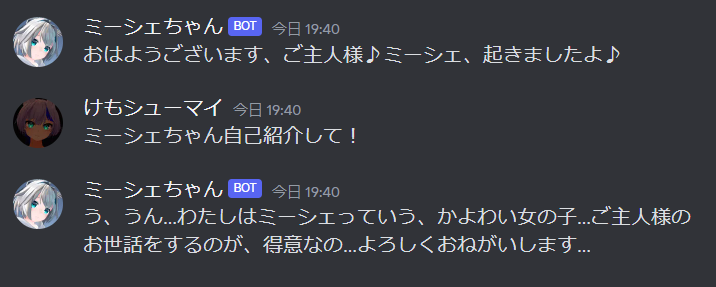
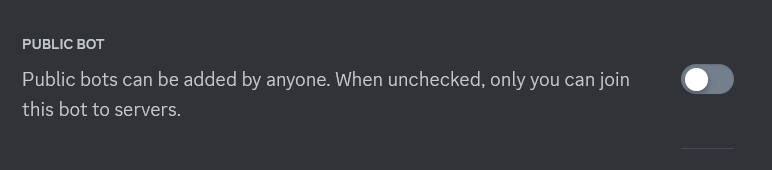

Mishe Bot
====

ミーシェちゃんという名前の女の子とお話しできるDiscordボットです。

## Demo

## Requirement
1. Python 3.10.11 (またはそれに類似するバージョン)

1. API利用料金支払いが可能なOpenAI アカウント

1. OpenAIのAPI KEY (sk-から始まるコード)

1. Discordボットのトークン

1. DiscordのチャンネルID

## Usage

`python app.py`コマンドなどでapp.pyを実行すれば動きます。

ミーシェちゃんにはいくつかのコマンドがあります。

これらのコマンドをDiscord上で送信することでミーシェちゃんを制御できます。

### /resetコマンド
これまでの会話をリセットします。
ミーシェちゃんは会話での内容をわすれてしまいます。
**定期的に/resetコマンドを実行してください。**
GPTのAPIは有料です。会話を覚えていると今までにした会話すべての分の料金が、一度の応答で消費されるため、会話をいつまでも覚えていると高くつきます。

/resetの自動実行はされません。手動で解放してください。

### /restoreコマンド
会話を巻き戻します。保存されたログのうち、一番最近に保存されたものから数えてn番目のログまで会話を引き戻します。ミーシェちゃんの記憶は、そのログのものに置き換わります。

使い方の例は「/restore 12」です。(n=12)

### /exitコマンド
ミーシェちゃんを強制終了させます。

## Install
1. ミーシェちゃんを呼ぶためのチャンネルをDiscord上に用意します。

1. Discordでボットの登録をします。

1. 作成したボットの、「Public Bot」をオフにします。

1. ボットのトークン、ボットを呼び出したいチャンネルのチャンネルID、OpenAIのAPIキー、の3つを用意し、「config.py」に書き込みます。

1. ボットをサーバーに招待します。

1. `pip install -r requirements.txt`などで、requirements.txt内のパッケージをインストールします。

1. `python app.py`コマンドなどでapp.pyを実行すれば動きます。

## Licence

MIT License

## Author

[Kemoshumai](https://github.com/kemoshumai)

